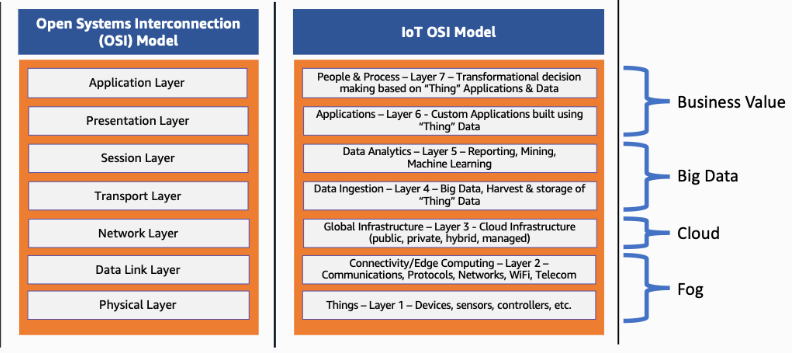

## **Mô hình OSI là gì?** 
Mô hình Kết nối các hệ thống mở (OSI) là một khung khái niệm chia các chức năng truyền thông mạng thành 7 lớp. Việc gửi dữ liệu qua mạng rất phức tạp vì các công nghệ phần cứng và phần mềm khác nhau phải hoạt động một cách hài hòa qua các ranh giới địa lý và chính trị. Mô hình dữ liệu OSI cung cấp một ngôn ngữ phổ quát cho mạng máy tính, vì vậy các công nghệ đa dạng có thể giao tiếp bằng cách sử dụng các giao thức tiêu chuẩn hoặc quy tắc truyền thông. Mỗi công nghệ trong một lớp cụ thể phải cung cấp các khả năng nhất định và thực hiện các chức năng cụ thể để trở nên hữu ích trong mạng. Các công nghệ ở những lớp cao hơn hưởng lợi từ việc rút gọn này vì chúng có thể sử dụng các công nghệ cấp thấp hơn mà không phải lo lắng về các chi tiết triển khai cơ bản.

## **Tại sao mỗ hình OSI lại quan trọng?**
Các lớp của mô hình Kết nối các hệ thống mở (OSI) tóm lược mọi loại hình giao tiếp mạng trên cả thành phần phần mềm và phần cứng. Mô hình này được thiết kế để cho phép hai hệ thống độc lập giao tiếp với nhau thông qua các giao diện hoặc giao thức được chuẩn hóa dựa trên lớp hoạt động hiện tại.

#### **Hiểu biết chung về những hệ thống phức tạp**
Các kỹ sư có thể sử dụng mô hình OSI để tổ chức và mô hình hóa các kiến trúc hệ thống kết nối mạng phức tạp. Họ có thể tách lớp hoạt động của từng thành phần hệ thống dựa theo chức năng chính của thành phần đó. Khả năng phân tách một hệ thống thành các phần nhỏ dễ quản lý thông qua việc trừu tượng hóa giúp mọi người dễ dàng khái niệm hóa hệ thống này một cách tổng thể.

#### **Nghiên cứu và phát triển nhanh hơn**
Với mô hình tham chiếu OSI, các kỹ sư có thể hiểu rõ hơn về công việc của mình. Khi tạo ra các hệ thống kết nối mạng mới cần giao tiếp với nhau, họ biết mình đang phát triển lớp (hoặc các lớp) công nghệ nào. Các kỹ sư có thể phát triển các hệ thống kết nối mạng và tận dụng một loạt các quy trình và giao thức có thể lặp lại. 

#### **Chuẩn hóa linh hoạt**

## **Bảy lớp của mô hình OSI là gì?**
Mô hình Kết nối giữa các hệ thống mở (Open Systems Interconnection – OSI) được phát triển bởi Tổ chức tiêu chuẩn hóa quốc tế và các tổ chức khác vào cuối những năm 1970. Mô hình này được ra mắt dưới dạng đầu tiên vào năm 1984 với tên ISO 7498, và phiên bản hiện tại là ISO/IEC 7498-1:1994. Dưới đây là 7 lớp của mô hình.

1. **Lớp vật lý(physical layer)**
Lớp vật lý là phương tiện truyền dẫn vật lý và các công nghệ để truyền dữ liệu qua phương tiện đó. Về cốt lõi, hoạt động truyền dữ liệu là việc truyền tín hiệu kỹ thuật số và điện tử thông qua các kênh vật lý khác nhau như cáp quang, cáp đồng và không khí. Lớp vật lý bao gồm tiêu chuẩn cho các công nghệ và chỉ số liên quan chặt chẽ với các kênh, chẳng hạn như Bluetooth, NFC và tốc độ truyền dữ liệu.

2. **Lớp liên kết dữ liệu (Data Link Layer)**
Lớp liên kết dữ liệu là các công nghệ được sử dụng để kết nối hai máy trên một mạng nơi lớp vật lý đã tồn tại. Lớp này quản lý khung dữ liệu – là các tín hiệu kỹ thuật số được gói gọn trong các gói dữ liệu. Kiểm soát lưu lượng và kiểm soát lỗi dữ liệu thường là trọng tâm chính của lớp liên kết dữ liệu. Ethernet là ví dụ về một tiêu chuẩn ở cấp độ này. Lớp liên kết dữ liệu thường được chia thành hai lớp phụ: lớp Kiểm soát truy cập phương tiện (Media Access Control – MAC) và lớp Điều khiển liên kết logic (Logical Link Control – LLC). 

3. **Lớp mạng(network layer)**
Lớp mạng liên quan đến các khái niệm như định tuyến, chuyển tiếp và xác định địa chỉ trên một mạng phân tán hoặc nhiều mạng được kết nối của các nút hoặc máy. Lớp mạng cũng có thể quản lý kiểm soát lưu lượng. Trên Internet, Giao thức Internet v4 (IPv4) và IPv6 được sử dụng làm giao thức lớp mạng chính.

4. **Lớp truyền tải(Transport layer)**
Trọng tâm chính của lớp truyền tải là đảm bảo rằng các gói dữ liệu đến đúng thứ tự, không bị mất mát/bị lỗi hoặc có thể được phục hồi liền mạch nếu được yêu cầu. Kiểm soát lưu lượng cùng với kiểm soát lỗi thường là trọng tâm tại lớp truyền tải. Ở lớp này, các giao thức thường được sử dụng bao gồm Giao thức điều khiển truyền tải (Transmission Control Protocol – TCP), một giao thức dựa trên kết nối gần như không suy hao và Giao thức gói dữ liệu người dùng (User Datagram Protocol – UDP), một giao thức không kết nối có suy hao. TCP thường được sử dụng khi tất cả dữ liệu phải còn nguyên vẹn (ví dụ: chia sẻ tệp), trong khi UDP được sử dụng khi việc giữ lại tất cả các gói ít quan trọng hơn (ví dụ: truyền phát video).
Lớp phiên

5. **Lớp phiên(Session class)**
Lớp phiên chịu trách nhiệm điều phối mạng giữa hai ứng dụng riêng biệt trong một phiên. Một phiên quản lý một kết nối ứng dụng một-một từ khi bắt đầu đến lúc kết thúc và xung đột đồng bộ hóa.

6. **Lớp trình bày(Presentation class)**
Lớp trình bày chủ yếu liên quan đến cú pháp của chính dữ liệu để các ứng dụng gửi và sử dụng.

7. **Lớp ứng dụng(Application layer)**
Lớp ứng dụng liên quan đến loại ứng dụng cụ thể và các phương thức giao tiếp được tiêu chuẩn hóa của nó. Ví dụ, các trình duyệt có thể giao tiếp bằng cách sử dụng Giao thức truyền siêu văn bản an toàn (HyperText Transfer Protocol Secure – HTTPS), HTTP và ứng dụng email có thể giao tiếp bằng POP3 (Post Office Protocol phiên bản 3) và SMTP (Simple Mail Transfer Protocol – Giao thức truyền thư đơn giản).

## **Làm thế nào để hoạt động truyền dữ liệu xảy ra trong mô hình OSI?**
Các lớp trong mô hình Kết nối giữa các hệ thống mở (Open Systems Interconnection – OSI) được thiết kế để một ứng dụng có thể giao tiếp qua mạng với một ứng dụng khác trên một thiết bị khác, bất kể sự phức tạp của ứng dụng và các hệ thống cơ bản. Để làm điều này, các tiêu chuẩn và giao thức khác nhau được sử dụng để giao tiếp với lớp bên trên hoặc bên dưới. Đây là các lớp độc lập và chỉ nhận thức được các giao diện để giao tiếp với lớp bên trên và bên dưới nó. 
Bằng cách liên kết tất cả các lớp và giao thức này lại với nhau, thông tin liên lạc dữ liệu phức tạp có thể được gửi từ ứng dụng cấp cao này sang ứng dụng cấp cao khác. Quy trình hoạt động như sau:
- Lớp ứng dụng của người gửi hoạt động truyền dữ liệu xuống tầng bên dưới tiếp theo.
- Mỗi lớp đều thêm các tiêu đề và địa chỉ riêng của nó vào dữ liệu trước khi chuyển dữ liệu đi. 
- Hoạt động truyền dữ liệu di chuyển xuống các lớp cho đến khi cuối cùng dữ liệu được truyền qua phương tiện vật lý.
- Ở đầu kia của phương tiện, mỗi lớp xử lý dữ liệu theo các tiêu đề có liên quan ở cấp độ đó. 
- Ở đầu thiết bị nhận, dữ liệu di chuyển lên từng lớp và dần dần được giải nén cho đến khi ứng dụng ở đầu kia nhận được dữ liệu.

## **Các lựa chọn thay thế cho mô hình OSI là gì?**
Các mô hình mạng khác nhau đã được sử dụng trong quá khứ, chẳng hạn như Tra đổi gói trình tự/Trao đổi gói Internet (Sequenced Packet Exchange/Internet Packet Exchange – SPX/IPX) và Hệ thống đầu ra đầu vào cơ bản của mạng (Network Basic Input Output System – NetBIOS). Ngày nay, giải pháp thay thế chính cho mô hình Kết nối giữa các hệ thống mở (Open Systems Interconnection – OSI) là mô hình TCP/IP.

#### **Mô hình TCP/IP**
Mô hình TCP/IP bao gồm năm lớp khác nhau:
- Lớp vật lý
- Lớp liên kết dữ liệu
- Lớp mạng
- Lớp truyền tải
- Lớp ứng dụng

Mặc dù các lớp như lớp vật lý, lớp mạng và lớp ứng dụng có vẻ như ánh xạ trực tiếp đến mô hình OSI, điều này không hoàn toàn đúng. Thay vào đó, mô hình TCP/IP ánh xạ chính xác nhất đến cấu trúc và giao thức của Internet.
Mô hình OSI vẫn là một mô hình mạng phổ biến để mô tả cách mạng vận hành, từ góc độ toàn diện cho mục đích giáo dục. Tuy nhiên, mô hình TCP/IP hiện nay được sử dụng phổ biến hơn trong thực tế.

---

Tài liệu tham khảo [https://aws.amazon.com/vi/what-is/osi-model/]